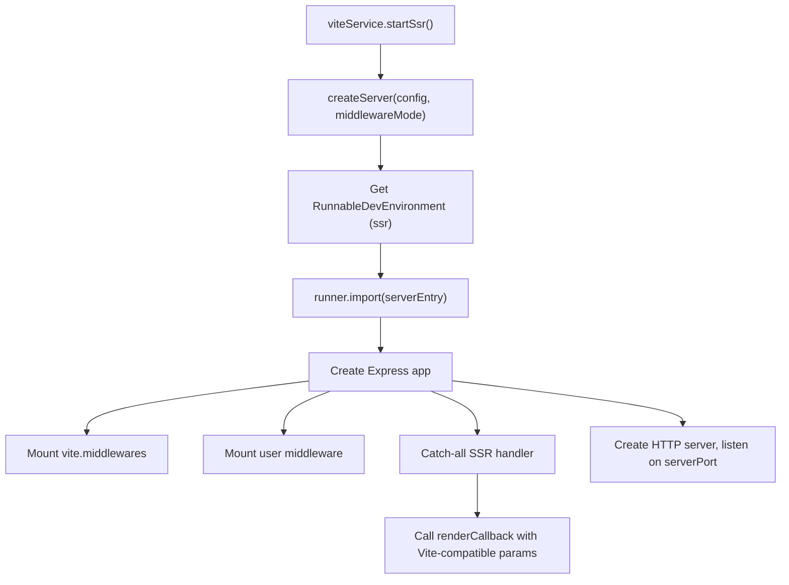

# Vite SSR Start Command

## Context

The webpack `start-ssr` handler ([webpack-start-ssr-handler.ts](packages/sku/src/program/commands/start-ssr/webpack-start-ssr-handler.ts)) runs two processes: a WebpackDevServer for client assets (HMR) and a separate server process (via `serverManager` / `cluster.fork`) running the user's Express app. The compiled server entry ([server.ts](packages/sku/src/services/webpack/entry/server/server.ts)) imports the user's `serverEntry`, wraps it with rendering utilities (`makeExtractor`, `SkuProvider`, etc.), and exports an Express app.

The Vite equivalent is simpler: a single Vite dev server in middleware mode handles both client assets/HMR and SSR in the same process, using `RunnableDevEnvironment.runner.import()` to load the user's server entry.

## Architecture



## Key Differences from Webpack

- **Single port**: Vite middleware + user's Express app run on the same HTTP server (no separate clientPort/serverPort split needed, but we use `port.server` for the main server)
- **No compilation step**: User's server entry is loaded on-the-fly via `runner.import()` (equivalent of `ssrLoadModule` but environment-aware)
- **No serverManager**: No `cluster.fork`; the server runs in-process with HMR support from Vite
- **Simplified rendering utilities**: Bare-bones stubs for `RenderCallbackParams` (no `ChunkExtractor`, no full loadable support)

## Files to Modify

### 1. `packages/sku/src/services/vite/index.ts` -- Add `startSsr` method

Add a `startSsr` method that:

1. Creates a Vite dev server in middleware mode using `createConfig(skuContext)` (without the `environment` param, so the middleware plugin is excluded)
2. Gets the `ssr` environment and verifies it's a `RunnableDevEnvironment` using `isRunnableDevEnvironment()`
3. Imports the user's server entry via `ssrEnv.runner.import(skuContext.paths.serverEntry)` -- the `configPlugin` already sets up the `__sku_alias__serverEntry` alias
4. Calls the default export with `{ publicPath: skuContext.publicPath }` to get `{ middleware, onStart, renderCallback }` (the `Server` interface from [types.ts](packages/sku/src/types/types.ts))
5. Creates an Express app:

- Mounts `vite.middlewares` (handles HMR websocket, asset serving, module transformation)
- Mounts user's `devServerMiddleware` if configured
- Mounts user's `middleware` from the server entry
- Adds a catch-all `GET` handler that calls `renderCallback` with bare-bones rendering params

1. Creates an HTTP(S) server and listens on `port.server`
2. Calls `onStart(app)` if provided, opens the browser

**Bare-bones `RenderCallbackParams` provided to `renderCallback`:**

```typescript
{
  SkuProvider: ({ children }) => children,  // pass-through (no JSX needed)
  addLanguageChunk: () => {},               // no-op for bare bones
  getBodyTags: () => [
    '<script type="module" src="/@vite/client"></script>',
    `<script type="module" src="${clientEntryPath}"></script>`,
  ].join('\n'),
  getHeadTags: () => '',
  flushHeadTags: () => '',
  extractor: {} as any,                     // stub - webpack-only
}
```

Key implementation details:

- `clientEntryPath` is the resolved path to the user's `clientEntry` (relative to project root for Vite to serve)
- `SkuProvider` as `({ children }) => children` works as a valid React functional component without JSX
- The `/@vite/client` script is manually injected since we bypass `transformIndexHtml`
- CSP support can be wired via `createCSPHandler` (same as [middleware.ts](packages/sku/src/services/vite/plugins/middleware.ts) lines 110-118) if `skuContext.cspEnabled`
- Use `allocatePort` for `port.server` (and optionally `port.client` if needed later)

**Imports needed:**

```typescript
import { createServer, isRunnableDevEnvironment } from 'vite';
import express from 'express';
import http from 'node:http';
import allocatePort from '../../utils/allocatePort.js';
import { getAppHosts } from '../../context/hosts.js';
import { serverUrls } from '@sku-private/utils';
import { openBrowser } from '../../openBrowser.js';
```

### 2. `packages/sku/src/program/commands/start-ssr/vite-start-ssr-handler.ts` -- Minor adjustments

The file already exists and calls `viteService.startSsr(skuContext)`. It may need minor adjustments:

- Print server URLs after `startSsr` returns (or let `startSsr` handle URL printing)
- The current logging references `skuContext.port.client` but should reference `skuContext.port.server` for the SSR server URL

## What This Does NOT Support (Bare Bones Scope)

- Full `@sku-lib/vite` loadable/collector support (SkuProvider is a pass-through)
- `transformIndexHtml` pipeline (SSR CSS injection via `vite-plugin-ssr-css`, other plugin HTML transforms)
- Vocab language chunk loading
- HTTPS dev server (can be added later by using `getCertificate` + `https.createServer`)
- Hot module replacement of the server entry (Vite handles client HMR; server module re-import on change would need `runner.import()` cache invalidation)
- `extractor` / `@loadable/server` functionality

## How to Verify

1. Create or use an existing SSR sku app with `bundler: 'vite'` in `sku.config.ts`
2. Run `nr start-ssr`
3. Verify the dev server starts and the app renders server-side HTML
4. Verify client-side hydration works (the client entry script loads)
5. Verify Vite HMR works for client-side changes
